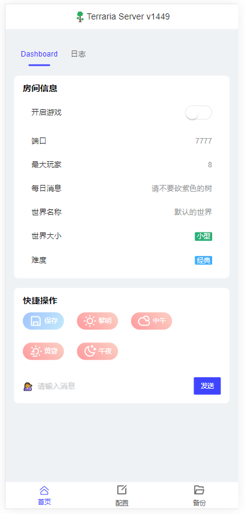
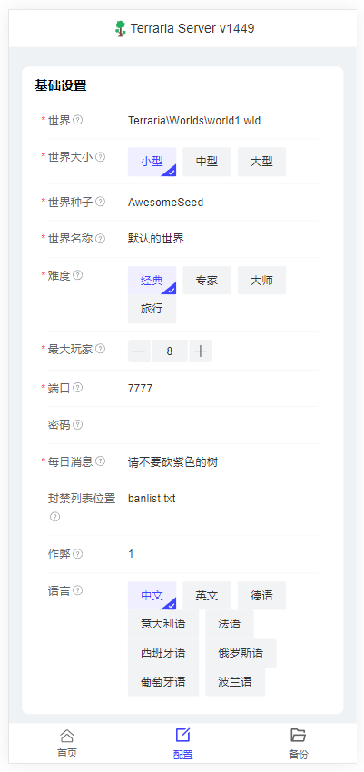

# Terraria-panel-app

泰拉瑞亚开服面板,  自带泰拉瑞亚 `1449` 版本

## 预览

**主页**



**配置页面**



## 运行

+ window

  双击

  ```sh
  terraria-panel.exe
  ```

+ Linux

  ```sh
  chmod +x terraria-panel
  ./terraria-panel
  ```

**浏览器访问 http://localhost:8080**

## 端口

默认 **8080** 短句, 打开 `config.ymal` 文件修改

```yaml
web:
  port: 8080
```

