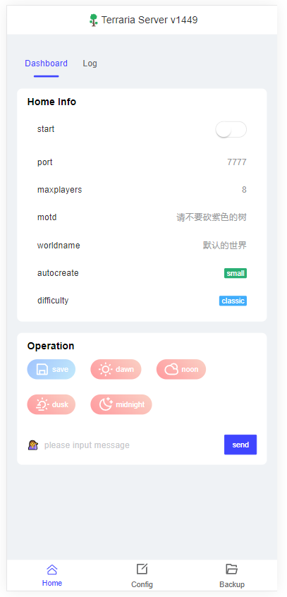

# Terraria-panel-app

**English** | [中文](./README-zh.md) 

Terraria server panel,  with Terraria `1449` version

## Preview

**Home Page**



**Config Page**


## RUN

+ window

  double click

  ```sh
  terraria-panel.exe
  ```

+ Linux

  ```sh
  chmod +x terraria-panel
  ./terraria-panel
  ```

**Browser access http://localhost:8080**

## PORT

Default port **8080**, open the `config.ymal` file edit

```yaml
web:
  port: 8080
```

